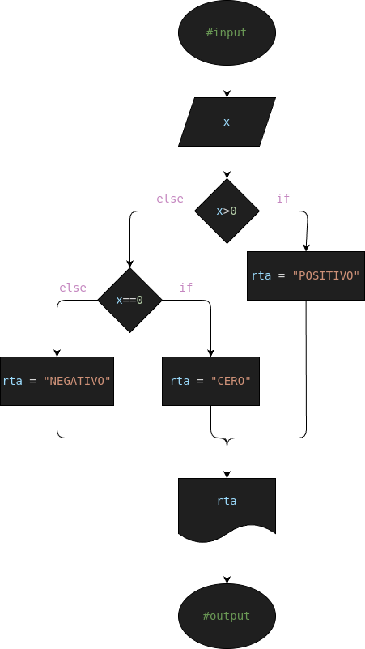

# Ejercicio #1: positive_number

Programa para verificar si un numero es Positivo o Negativo

## Analisis

### Variable de entrada
- x= Numero

### Procesamiento
- Ultimo Digito = s%10
- Penultimo Digito = (s//10)%10
---
- $ if (x>0): $
- $    rta = "POSITIVO" $
- $ else: $
- $    rta = "NEGATIVO" $

### Variable de salida
- Es Positivo
- Es Negativo

## Diseño

## Construccion

- Codigo implementado en el archivo "positive_number.py"