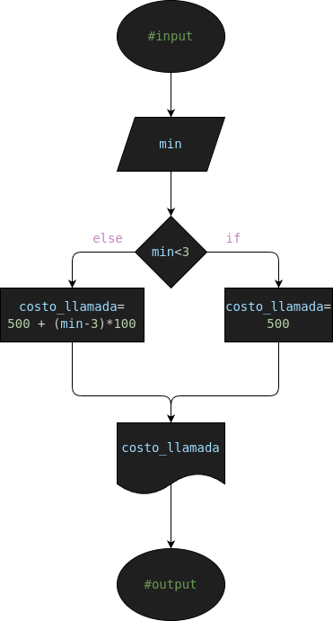

# Ejercicio #2: call_limit

Programa para calcular el Costo de una llamada dependiendo de su duracion

## Analisis

### Variable de entrada
- min= Minutos (Duracion de la llamada)

### Procesamiento
- costo_llamada= Costo de la llamada
---
- $ if (min<3): $
- $    costo_llamada = 500 $
- $ else: $
- $    costo_llamada = 500 + (min-3)*100 $

### Variable de salida
- P= Precio de la llamada

## Diseño

## Construccion

- Codigo implementado en el archivo "call_limit.py"