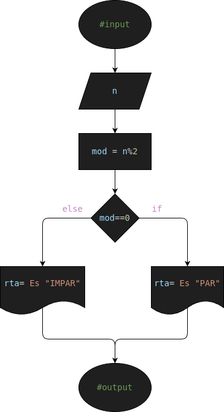

# Ejercicio #3: even_number

Programa para definir si un numero es Par o Impar

## Analisis

### Variable de entrada
- x= Numero (Par o Impar)

### Procesamiento
- mod= Modulo
---
- $ mod = x °/. 2 $
- $ if (mod==0): $
- $    rta = PAR $
- $ else: $
- $    rta = IMPAR $

### Variable de salida
- Numero Par
- Numero Impar

## Diseño

## Construccion

- Codigo implementado en el archivo "even_number.py"