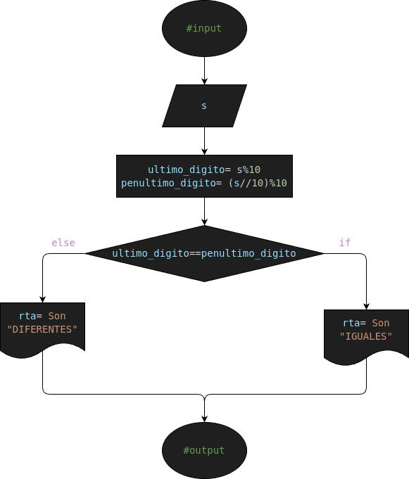

# Ejercicio #4: last_2_similar_digits

Programa para verificar si las dos ultimas cifras de un numero son similares

## Analisis

### Variable de entrada
- s= Numero

### Procesamiento
- ultimo_digito= Ultimo Digito= s%10
- penultimo_digito= Penultimo Digito= (s//10)%10
---
- $ if (x>0): $
- $    rta = "POSITIVO" $
- $ else: $
- $    rta = "NEGATIVO" $

### Variable de salida
- Es Positivo
- Es Negativo

## Diseño

## Construccion

- Codigo implementado en el archivo "last_2_similar_digits.py"