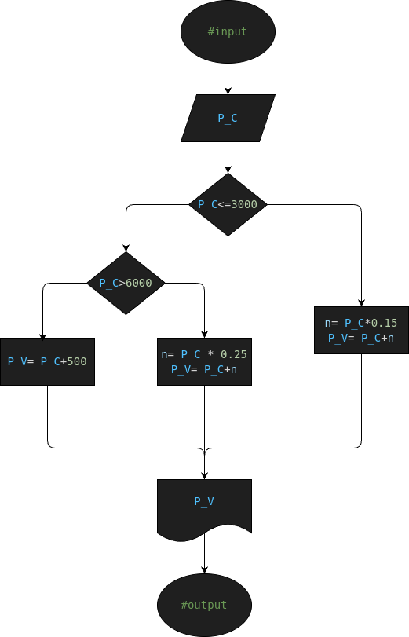

# Ejercicio #6: sell_price

Programa para saber cual es el precio de venta de un producto

## Analisis

### Variable de entrada
- n1= Primer Numero
- n2= Segundo Numero
- n3= Tercer Numero

### Procesamiento
- mayor= Variable para Confirmar el Numero mayor
---
- $ if (n1>=n2 and n1>=n3): $
- $     mayor= n1 $
- $ elif (n2>=n1 and n2>=n3): $
- $     mayor= n2 $
- $ else: $
- $     mayor= n3 $

### Variable de salida
- El "n1" es el Mayor
- El "n2" es el Mayor
- El "n3" es el Mayor

## Diseño

## Construccion

- Codigo implementado en el archivo "largest_number_of_3.py"