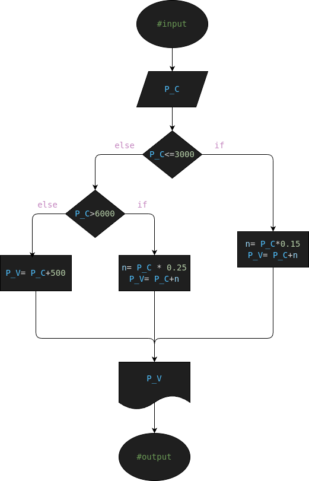

# Ejercicio #6: sell_price

Programa para saber cual es el precio de venta de un producto

## Analisis

### Variable de entrada
- P_C= Precio de Compra

### Procesamiento
- n= Valor
- P_V= Precio de venta
---
- $ if (P_C<=3000): $
- $    n= P_C*0.15 $
- $    P_V= P_C+n $
- $ else: $
- $    if (P_C>6000): $
- $       n= P_C * 0.25 $
- $       P_V= P_C+n $
- $ else: $
- $       P_V= P_C+500 $

### Variable de salida
- El nuevo precio de venta
## Diseño

## Construccion

- Codigo implementado en el archivo "largest_number_of_3.py"